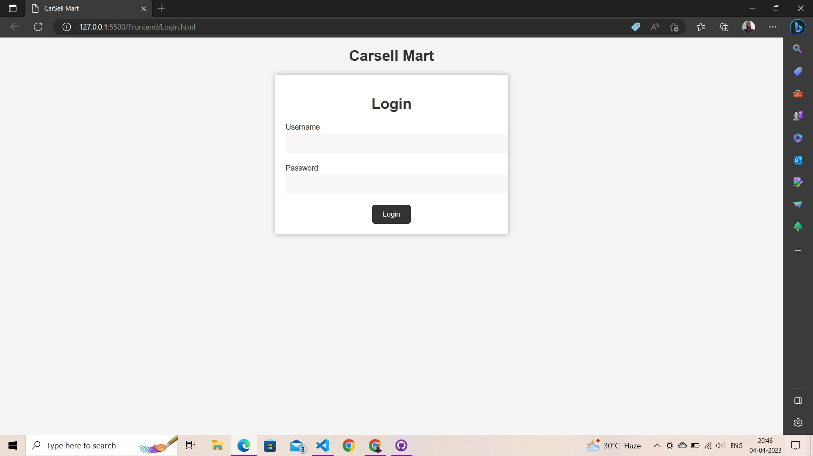
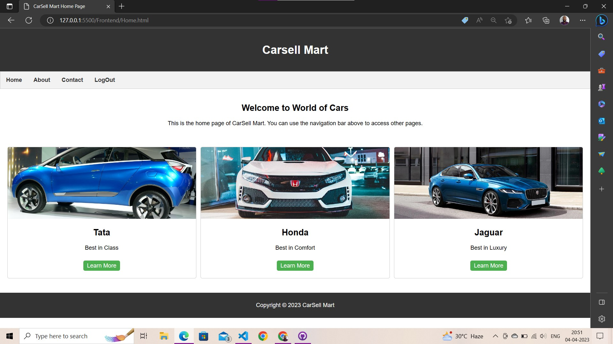
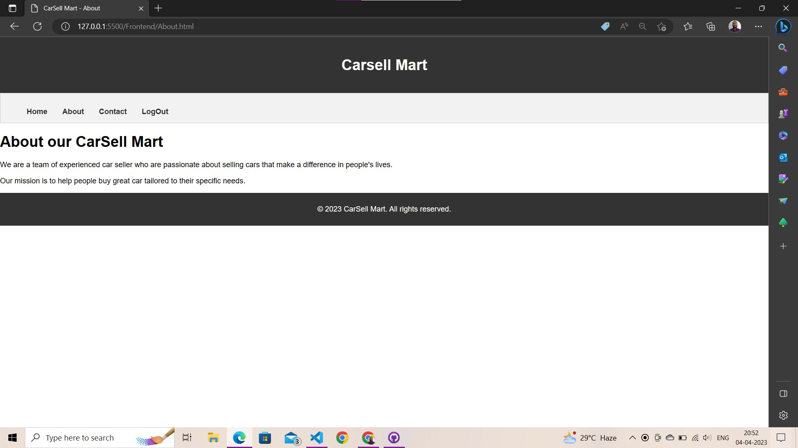
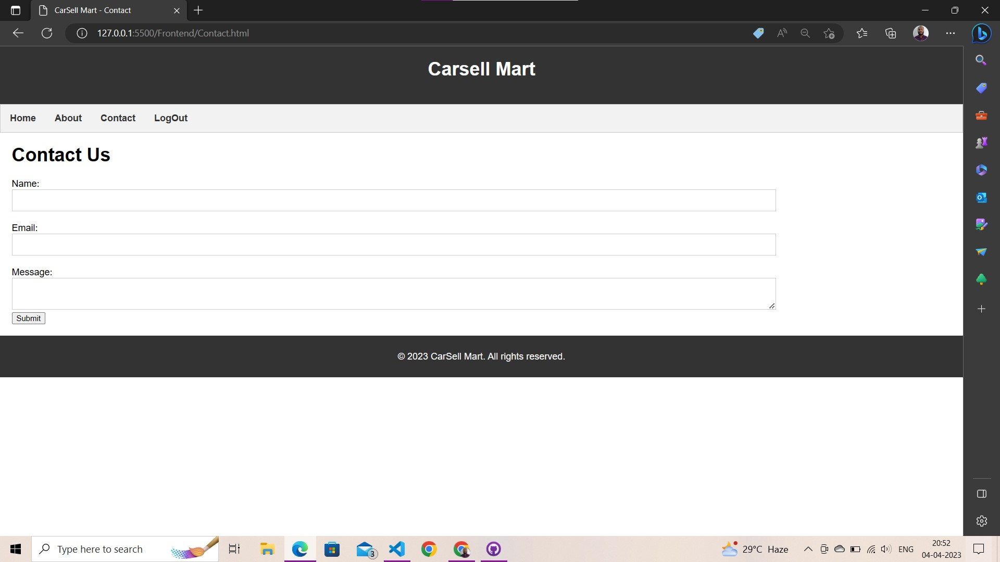

# Car Selling Website by Naveen Dhanwar

This project has two part Backend and Frontend.

## Backend

- The backend is created using Express.js, and Mongodb node driver.
- Using Atlas Mongodb in cloud.
- Made two APIs Login and Contact.
-

## Frontend

- The frontend is just html, css and vanilla javascript.
- For session management using browser local storage.
- It has four pages, Login, contact, home and about. (Image atteched below)
- Each page has a check for session, without session page will rediract to login page automatically.
- for responsiveness used media queries for css.

## Testing

- Username and Password for login is: naveen - naveen.

## Images

